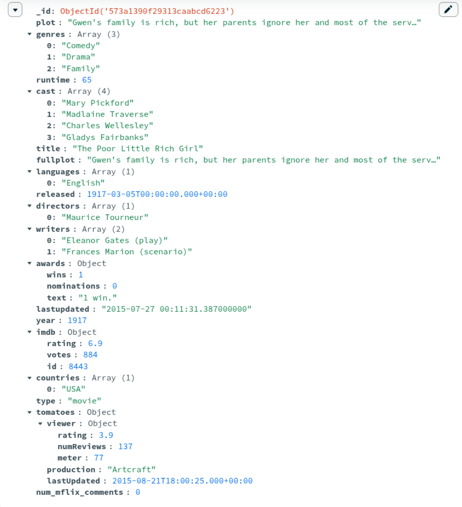

# Mongodb crud
MongoDB crud operations from Python

Ejemplo de un registro MongoDb (documento):
<center></center>

Para cargar las librerias, abre la terminal, crea un ambiente (.venv) y ejecuta en la terminal ```pip install -r requirements.txt```

Dentro de la carpeta del proyecto:
```bash
python3 -m venv .venv
source .venv/bin/activate
pip install -r requirements.txt
```